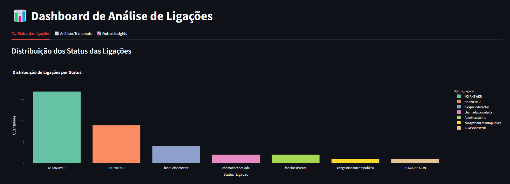

# Callback Return Rate Analysis

## 📌 Descrição
Este projeto consiste em um **Dashboard Interativo** desenvolvido com **Streamlit** e tratamento de dados via Google Colab, para analisar dados de ligações e retornos de clientes. O objetivo é visualizar insights importantes sobre os status das chamadas, tendências temporais e padrões de comportamento dos clientes. Visando um planejamento estrátegico e dinâmico, também sendo possível utilizar os dados para treinamento de modelos matemáticos com finalidade de predições.

## 🚀 Funcionalidades

- **Análise de Status das Ligações:**
  - Distribuição de ligações por status.
  - Duração média das chamadas para cada status.

- **Análises Temporais:**
  - Evolução do número de ligações ao longo do tempo.
  - Identifica os melhores horários para contato com os clientes.

- **Outros Insights:**
  - Ligações por tipo de telefone.
  - Top 10 clientes que mais retornam chamadas.

## 🛠 Tecnologias Utilizadas
- **Python** (3.13.2)
- **Streamlit** (para visualização interativa)
- **Pandas** (para manipulação de dados)
- **Plotly** (para criação de gráficos dinâmicos)

## 📂 Estrutura do Projeto
```
├── dashboard.png
├── README.md
├── call_data.csv
├── callback_return_rate_analysis.ipynb
├── requirements.txt
└── showdata.py
```

## 📋 Requisitos
Certifique-se de ter instalado o **Python 3.13.2** e as bibliotecas necessárias:
```bash
pip install -r requirements.txt
```

## ▶ Como Executar
1. Clone este repositório:
   ```bash
   git clone https://github.com/GBAlvim/callback_return_rate_analysis.git
   ```
2. Acesse o diretório do projeto:
   ```bash
   cd callback_return_rate_analysis
   ```
3. Execute o Dashboard Streamlit:
   ```bash
   streamlit run showdata.py
   ```

## 📊 Imagem dashboard inicial


## 📢 Autor
**Gabriel Alvim**  
Analista - Desenvolvedor de Software

